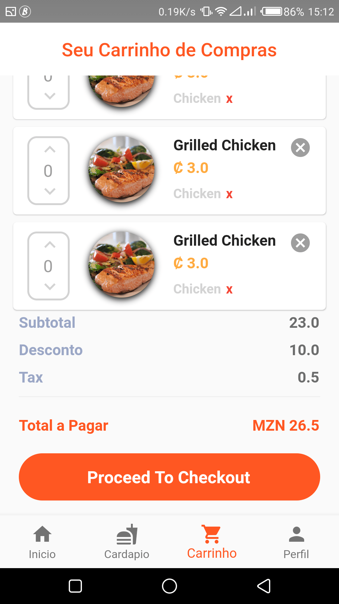
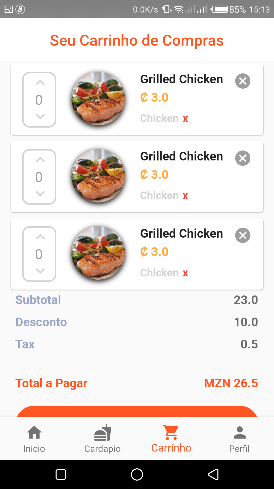
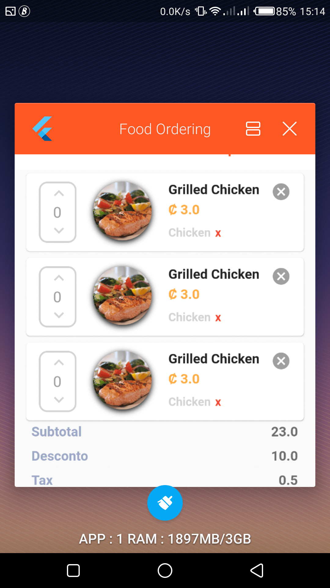

# FOOD ORDERING USER INTERFACE APP PROJECT

Esse projecto apresenta um UI de aplicativo para ordem de refeicoes desenvolvido usando Framework Flutter e Dart.
Flutter um um framework que vem revolucionar o mercado na area de desenvolvimento de aplicativos moveis tendo como uma vantagem um desenvolvimento agil e cross-plataform ou seja Um codigo serve para duas plataformas diferentes(Android e IOS).

# Algumas imagens daquilo que ja foi desenvolvido
 &nbsp; &nbsp;  &nbsp; &nbsp; 

 &nbsp; &nbsp;  &nbsp; &nbsp;   

